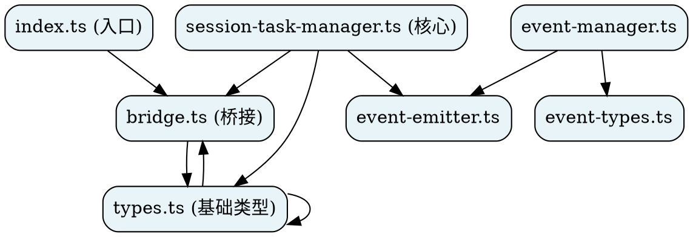

# task-plugin-v3 依赖关系图

生成时间：2026-04-17 02:37 UTC
工具：`scripts/import-indexer.py`

---

## 依赖层级结构

```
【入口层】
  index.ts
    └── bridge.ts

【协调层】
  session-task-manager.ts (核心协调器)
    ├── types.ts
    ├── bridge.ts
    ├── event-emitter.ts

【事件层】
  event-manager.ts
    ├── event-types.ts
    └── event-emitter.ts

【基础层】
  types.ts (基础类型定义)
    └── 无依赖

【桥接层】
  bridge.ts (OpenClaw API桥接)
    ├── types.ts
    └── OpenClaw API (外部)
```

---

## 统计信息

| 指标 | 数量 |
|------|------|
| 总文件 | 24 |
| 源码文件 | 10 (src/*.ts) |
| 测试文件 | 4 |
| 示例文件 | 3 |
| 配置文件 | 7 |
| 总导入关系 | 27 |
| 孤立文件 | 8 |

---

## 被依赖最多的文件

| 文件 | 被依赖次数 | 说明 |
|------|-----------|------|
| **bridge.ts** | 3 | OpenClaw API桥接，核心依赖 |
| **event-emitter.ts** | 2 | 事件发射器 |
| **types.ts** | 1 | 基础类型定义 |
| **event-types.ts** | 1 | 事件类型定义 |

---

## DOT格式依赖图

可在 [GraphvizOnline](https://dreampuf.github.io/GraphvizOnline/) 可视化：



---

## 核心依赖路径

### 任务创建流程
```
index.ts
  → bridge.ts
    → OpenClaw API
```

### 事件处理流程
```
session-task-manager.ts
  → event-emitter.ts
    → event-types.ts
  → event-manager.ts
    → event-emitter.ts
    → event-types.ts
```

---

## 外部依赖

- **OpenClaw API** (`runtime.taskFlow`)
- **Node.js EventEmitter**
- **Vitest** (测试框架)

---

## 生成工具

依赖图由 `scripts/import-indexer.py` 自动生成：

```bash
# 生成依赖图
python3 ~/.openclaw/workspace/scripts/import-indexer.py \
  ~/.openclaw/workspace/projects/task-plugin-v3 \
  --output dependency-graph.json

# 可视化
python3 ~/.openclaw/workspace/scripts/import-indexer.py \
  dependency-graph.json
```

---

## 索引建立

此依赖图已建立索引，可在以下位置找到：

1. **JSON数据**：`task-plugin-v3/dependency-graph.json`
2. **可视化文档**：`task-plugin-v3/docs/DEPENDENCY-GRAPH.md`
3. **知识库索引**：`memory/docs/knowledge-base-index.md`

---

**生成时间**: 2026-04-17 02:37 UTC
**生成工具**: `scripts/import-indexer.py`
**来源**: 从CC迁移的依赖分析工具